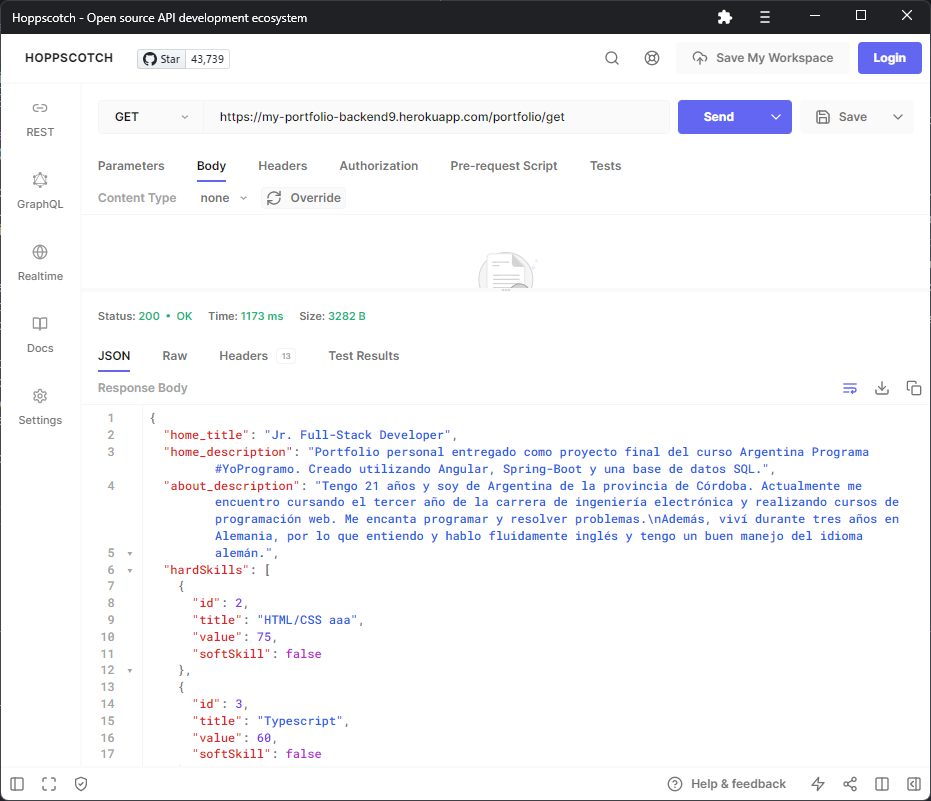
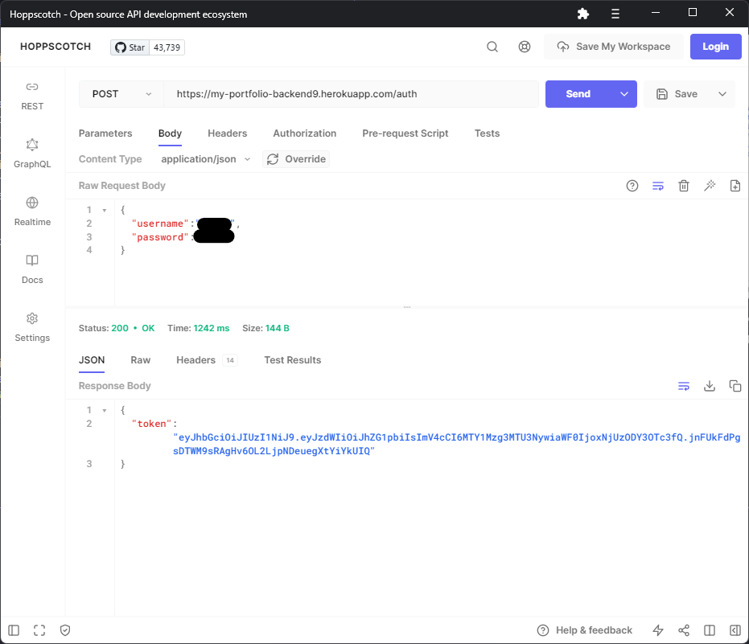
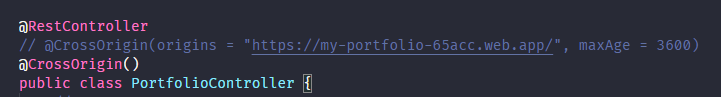
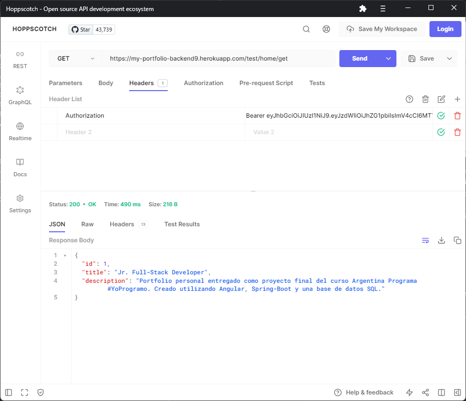
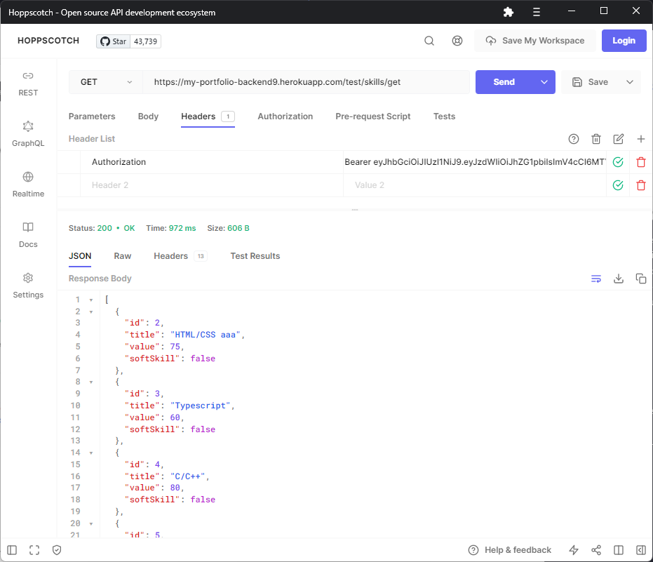
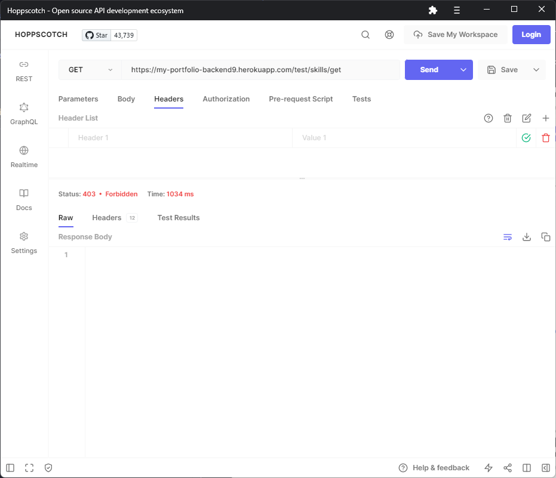

# Mi Portfolio - Mariano Perez

### Argentina Programa - [#YoProgramo](http://www.yoprogramo.org.ar/)

### Capa Backend

Desarrollada con [Spring Boot](https://spring.io/projects/spring-boot) y hosteada en [Heroku](https://dashboard.heroku.com/apps)

Repositorio de la capa frontend: [github.com/marandres9/portfolio-front](https://github.com/marandres9/portfolio-front)

El portfolio web está dividido en secciones. En la capa fontend, inicialmente se recibe un DTO con toda la información que debe mostrar cada sección y luego los datos de cada una son distribuidos a sus respectivos componentes, los cuales se encargan de mostrarlos. La base de datos de este portfolio contiene una tabla para cada una de las secciones, las cuales son:
- Home (Da una breve descripción del portfolio)
- About (Información sobre el autor)
- Skills (Muestra las habilidades)
- Education (Muestra el historial de educación)
- Experience (Muestra la experience laboral)
- Projects (Contiene un listado de todos los proyectos y sus respectivos repositorios)

Esta aplicación permite acceder a las bases de datos para obtener o modificar sus contenidos y mediante sus controladores REST (uno para cada tabla/sección) expone endpoints para que sean utilizados por el cliente.

Además, la aplicaciión backend cuenta con un servicio de autenticación, el cual mediante un filtro es capaz de interceptar cualquier solicitud desde el frontend y veirificar si el usuario esta autorizado a acceder o a llevar a cabo operaciones sobre la base de datos. 

La aplicación provee únicamente dos endpoints a los que un usuario no autenticado con un token JWT puede acceder. Dichos endpoints son *"/portfolio/get"* y *"/auth"*, cuyas respectivas funciones son la de devolver un objeto DTO que contiene toda la información del portfolio que se encargará de mostrar la aplicación frontend, y la de autenticar a un usuario enviando las credenciales al servidor y devolviendo el token JWT o avisando que son inválidas. Esto es así ya que cualquier cliente debe poder visualizar el portfolio y iniciar sesión.

Por otra parte, cualquier operación que modifique los contenidos de la página deberá realizarla un usuario autorizado con un token JWT.

En la siguiente imagen se muestra la llamada a la API que devuelve los datos del portfolio. El objeto sería recibido por el frontend y distribuido en sus componentes.

A continuación se muestra el proceso de autenticación. Se hace una petición POST al endpoint */auth* enviando las credenciales y se recibe el token JWT que deberá ser incluido en la cabecera *Authorization* para cualquiera de las peticiones que requiran de autorización.

**Importante:** Tener en cuenta que para realizar peticiones HTTP *no simples* desde un cliente como Postman/Hoppscotch o desde la terminal utilizando cURL/wget se debe cambiar la configuración CORS del controlador REST, ya que en la versión final desplegada en Heroku solo se aceptan peticiones desde el origen especifico de la aplicación frontend. Para el ejemplo de inicio de sesión, que requiere del método HTTP POST, se realizó la siguiente modificación, reemplazando la anotación *@CrossOrigin* original por una sin parámetros, para permitir peticiones desde cualquier origen:

Por último, se muestra una petición GET realizada a endpoints de prueba. Los mismos requieren de autorización, por lo que deben incluir una cabecera de tipo *Authorization*, y devuelven los contenidos de las secciones **Home** y **Skills** del portfolio. Como se mencionó, estos endpoints son solo de prueba y no son utilizados por la aplicación frontend.

Llamadas a los endpoints */test/home/get/*  y a */test/skills/get/* utilizando el token JWT recibido en el ejemplo de autenticación:

Si no se envía un JWT en la cabecera de la petición, se obtiene un error HTTP 403, ya que el usuario no esta autorizado a realizar esa operación:
